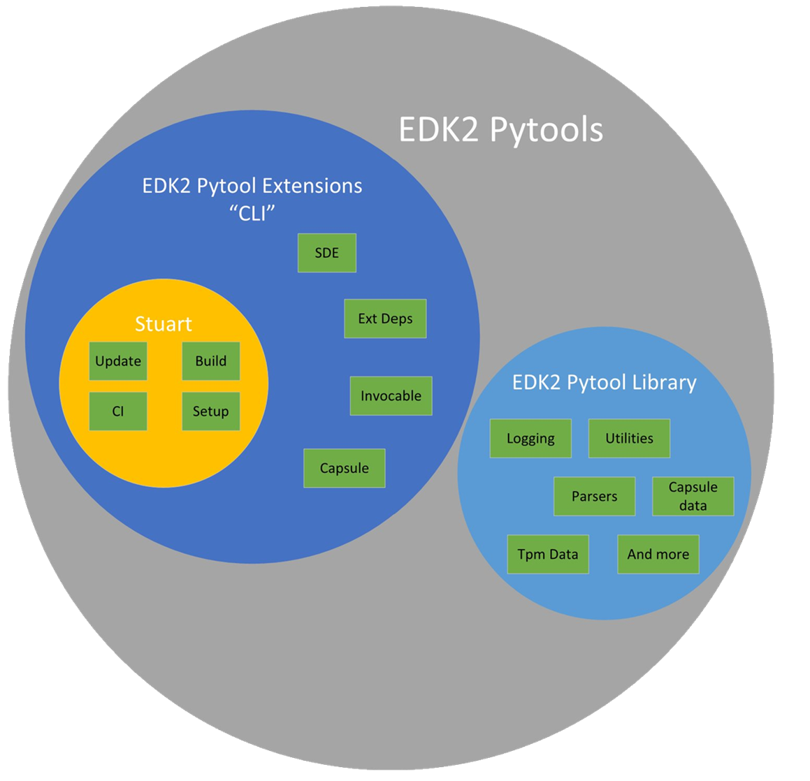

# Developing Tianocore Edk2 PyTool Extensions (edk2toolext)

There are a lot of parts of pytools. Here's a helpful diagram to help you sort
out all the different parts.



## Pre-Requisites

* Make sure you have python 3.7.x or newer available on path
* Make sure you have git installed and available on path

1. Get the code

    ``` cmd
    git clone https://github.com/tianocore/edk2-pytool-extensions.git
    ```

2. __Strongly Recommended__ Create a Python virtual environment
   1. open cmd prompt

   2. Navigate to parent folder of where you cloned
      * NOTE: this is where I like to create my virtual environments.  You can
        organize these however you like but you will want to launch this virtual
        environment each time you want to work on or test pytools.

   3. run `python -m venv pytool-ext-venv` to make your virtual environment.  In
      this case `pytool-ext-venv` is the name of the virtual environment and
      folder that will be created.  You can name it whatever works for you.

   4. Activate the virtual environment for this session

      ```cmd
      pytool-ext-venv\Scripts\activate
      ```

   5. Your shell prompt should now indicate you are in a virtual environment.

   6. change working directory to the root of the cloned repository.

3. Install development dependencies into this virtual environment

    ``` cmd
    pip install --upgrade -r requirements.txt
    ```

4. Uninstall any copy of edk2-pytool-extensions

    ``` cmd
    pip uninstall edk2-pytool-extensions
    ```

5. Install from local source (run command from root of repo)

    ``` cmd
    pip install -e .
    ```

6. To support spell checking / validation NodeJs and cspell are used.

    * Install NodeJS from <https://nodejs.org/en/>
    * Use npm to install cspell.

      ```cmd
      npm install -g cspell
      ```

    * Src and doc available:
      * <https://github.com/streetsidesoftware/cspell>
      * <https://www.npmjs.com/package/cspell>

7. To support linting the markdown files NodeJs and markdownlint are used.

    * Install NodeJS from <https://nodejs.org/en/>
    * Use npm to install markdownlint-cli.

      ```cmd
      npm install -g markdownlint-cli
      ```

    * Src and doc available:
      * <https://www.npmjs.com/package/markdownlint>
      * <https://www.npmjs.com/package/markdownlint-cli>

## Testing

1. Run a Basic Syntax/Lint Check (using flake8) and resolve any issues

    ``` cmd
    flake8 .
    ```

    INFO: Newer editors are very helpful in resolving source formatting errors
    (whitespace, indentation, etc). In VSCode open the py file and use
    ++alt+shift+f++ to auto format.

2. Run the `BasicDevTests.py` script to check file encoding, file naming, etc

    ```cmd
    BasicDevTests.py
    ```

3. Run pytest with coverage data collected

    ``` cmd
    pytest -v --junitxml=test.junit.xml --html=pytest_report.html --self-contained-html --cov=edk2toolext --cov-report html:cov_html --cov-report xml:cov.xml --cov-config .coveragerc
    ```

    INFO: If you only want to test a single file you can supply that path at the
    end and then only that module will be run.

    Coverage is uploaded to `codecov.io`. For more information, review
    `coverage.md` in the docs folder.

4. Look at the reports
    * pytest_report.html
    * cov_html/index.html

5. Run the spell checker

    ```cmd
    cspell -c .cspell.json "**/*.py" "**/*.md"
    ```

6. Run the markdown linter

    ```cmd
    markdownlint "**/*.md"
    ```

## Conventions Shortlist

### File and folder names

Use python defined Pep conventions.  For example package, module, and class
naming should follow PEP8 (<https://www.python.org/dev/peps/pep-0008/>)

### Comments

Docstring style comments should be added to each public function and class.
\*Existing code should be updated to be compliant as it is modified.

### New Module or Class

When creating a new module or class it should be clearly defined for a single
purpose and provide general purpose support.

Documentation of the feature should be added to the __docs/features__ folder in
markdown format.  The filename should be the package import path.  For example
for _edk2toolext.pkg1.mod1.py_ module the filename for documentation would be
`pkg1.mod1.md`.  The content of this documentation should be focused on why.
Docstrings within the module should describe functional parameters and usage
info.

Unit tests should be written in python unittest or pytest format.  A test module
should be added __test__ folder.  The filename should be `test_module.py`.

### Spell Checking / False Positives

The cspell dictionary is not perfect and there are cases where technical words
or acronyms are not found in the dictionary.  There are two ways to resolve
false positives and the choice for which method should be based on how broadly
the word should be accepted.

#### CSpell Base Config file

If the change should apply to all files in repository code and documentation
then it should be added to the base config file (__.cspell.json__) `words`
section.  This is a list of accepted words for all spell checking operations in
the repository.

#### In-line File

CSpell supports numerous methods to annotate your files to ignore words,
sections, etc.  This can be found in CSpell documentation.  Suggestion here is
to use a c-style comment at the top of the file to add words that should be
ignored just for this file.  Obviously this has the highest maintenance cost so
it should only be used for file unique words.

``` c
// spell-checker:ignore unenroll, word2, word3
```

or

```ini
# spell-checker:ignore unenroll, word2, word3
```

### Markdown linting

The linter uses the configuration defined in `.markdownlint.yaml` file found at
the root of the repository.

#### In-line Ignore

See options listed here
<https://github.com/DavidAnson/markdownlint#configuration> to ignore rules,
ignore lines, or ignore files.
